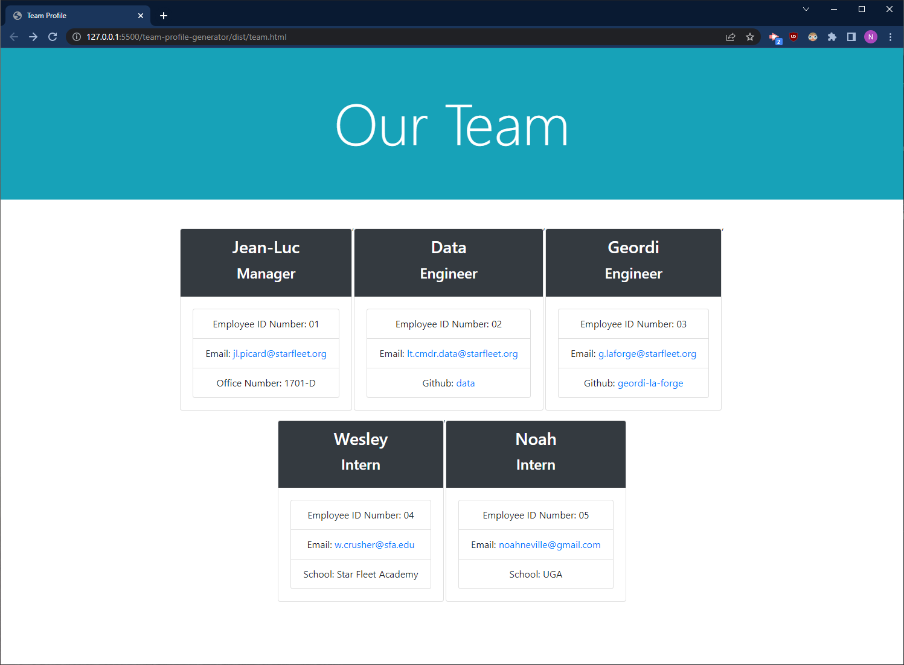

# Team Profile Generator

A command line application that generates an HTML page for all of your team members.

## Installation

Clone this repo from [Github](https://github.com/noahneville/team-profile-generator). Open in your terminal of choice, type "npm i" to install all necessary packages, then type "node index.js" in the terminal to start the application. When you're finished, your generated HTML page will be available in the 'dist' directory. 

## Demo

Here's an example of the HTML file generated after running this application. 

And here's a gif of the actual application.

## License

MIT

## Acknowledgements

Thanks to my tutor Dan Ringenbach for helping me debug this.